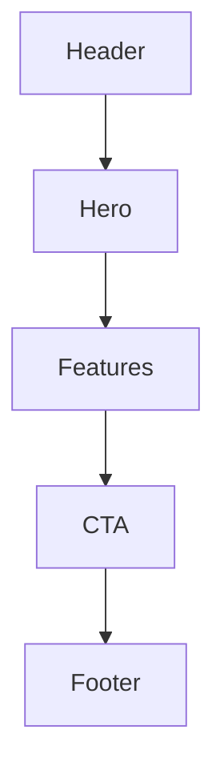

# Prompt: 03 Analyze — L3 Templates

> 用途：抽取頁面模板對齊 `03_templates_spec.md`
> 執行者：Claude 主對話

---

## 給 Claude 的 Prompt

```
任務：讀取 clones/{slug}/raw/screenshots/ 與 extracted/dom-tree.md，
輸出 clones/{slug}/analysis/L3_templates.md，對齊 03_templates_spec.md。

Template = 頁面骨架（不是元件、不是模式）。
是【整頁的版面組合方式】。

對每個觀察到的頁面類型輸出：

## Template: {Landing / Dashboard / List / Detail / Settings / Pricing / ...}

### 區塊組成（由上到下）
1. Header (sticky? transparent on top?)
2. Hero Section (full-width / contained, asymmetric / centered)
3. Feature Grid (3-col / 2-col / alternating)
4. Social Proof
5. CTA Section
6. Footer

### Layout 規則
- Container max-width
- Section vertical spacing
- 區塊之間是否有 divider

### Responsive 行為
- Mobile：哪些區塊改變排列
- Tablet：欄數變化
- Desktop：是否有 wide-screen 特殊處理

### Mermaid 結構圖


---

至少抽取 1 個 Template（首頁 / Landing）。
若有多種頁面類型，依序加章節。

紅線：
- Template 是版面結構，不要寫具體文案內容
- 每個 Template 引用 L0 的 grid token
```

---

## 驗收

- [ ] 至少 1 個 Template 完整描述
- [ ] 每個 Template 有 Mermaid 結構圖
- [ ] Responsive 行為有描述
