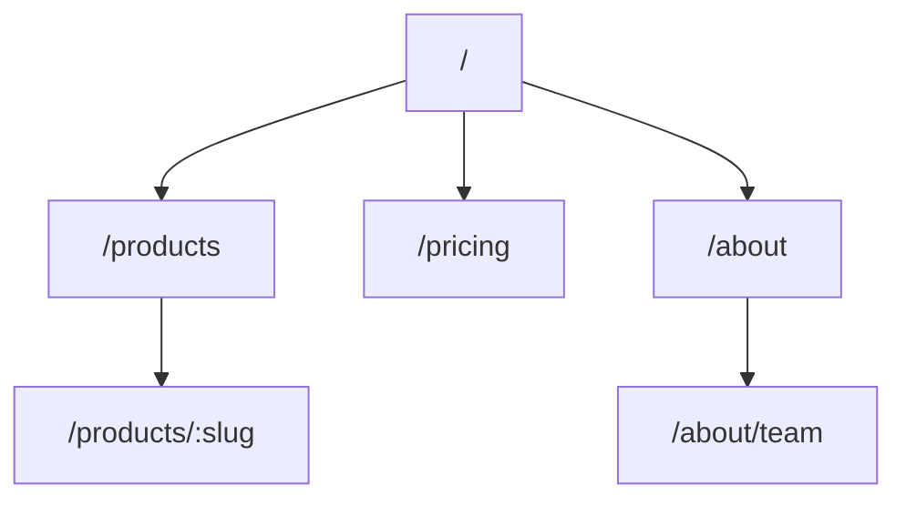

# Prompt: 03 Analyze — L4 Sitemap

> 用途：產出網站結構圖（新層，不對應既有 spec）
> 執行者：Claude 主對話

---

## 給 Claude 的 Prompt

```
任務：訪問目標 URL，分析整站結構，輸出 clones/{slug}/analysis/L4_sitemap.md。

可用 WebFetch 跟隨主導航連結（深度 2）。
不要爬全站，只抓主導航 + footer 連結。

格式：

# Sitemap — {domain}

## 頁面層級



## 頁面清單

| Path | 類型 | 主要功能 | 對應 Template |
|------|------|----------|---------------|
| / | Landing | 產品介紹 + CTA | Landing |
| /products | List | 產品列表 | List |
| /products/:slug | Detail | 產品詳情 | Detail |
| /pricing | Pricing | 方案比較 | Pricing |

## 導航結構

### 主選單
- Item 1 → /path1
- Item 2 → /path2

### Footer
- Group 1：xxx, yyy
- Group 2：xxx

## 對應原型推測

> 對應 references/website_recipes.md 的哪個原型？

- 主要：{e.g., SaaS Landing}
- 次要：{e.g., Marketing Site}

紅線：
- 不爬登入後路徑
- 不複製頁面標題的具體文字（用功能描述代替）
- 最多列 30 個頁面
```

---

## 驗收

- [ ] Mermaid sitemap 存在
- [ ] 頁面清單對應到 L3 的 Template
- [ ] 對應原型推測有依據
