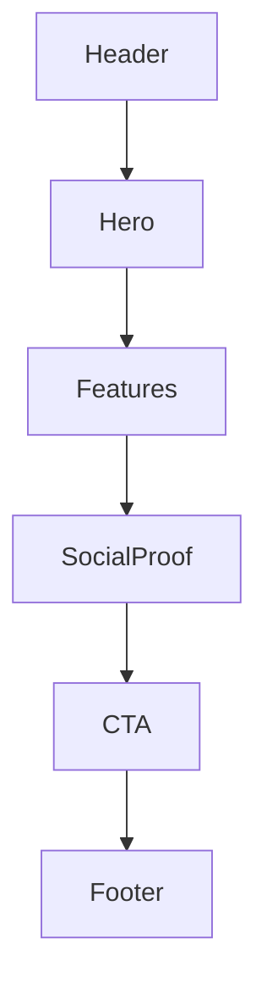

# L3 Templates — {slug}

> 對齊 `03_templates_spec.md` 結構

---

## Template: Landing

### 區塊組成（由上到下）
1. Header — TBD（sticky? transparent?）
2. Hero — TBD
3. Features — TBD
4. Social Proof — TBD
5. CTA — TBD
6. Footer — TBD

### Layout 規則
- Container max-width：TBD
- Section vertical spacing：TBD
- Divider 使用：TBD

### Responsive
- Mobile：TBD
- Tablet：TBD
- Desktop：TBD

### 結構圖

---

## Template: {Other}

（依需要新增）
